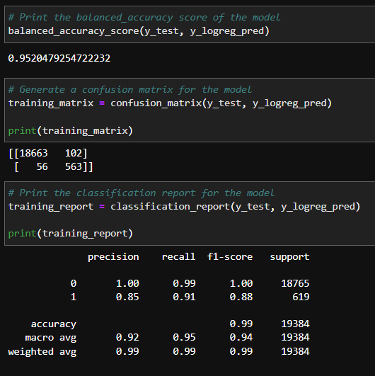

# Credit Risk Classifier

This Jupyter notebook is meant to demonstrate how using a resampled data model when modeling a prediction can create better performance in it's results and provide better accuracy than using just the original data as it came to train the model.
The notebook contains the whole process of model, fit, predict, evaluate for logistic regression models for both the original data, and the resampled data. The evaluations are conducted using different SciKit Learn functions like `balanced_accuracy_score`, `confusion_matrix`, and `classification_report`/`classification_report_imbalanced`.

---

## Technologies

### Libraries:
* Pandas
* NumPy
* balanced_accuracy_score from sklearn.metrics
* confusion_matrix from sklearn.metrics
* classification_report from sklearn.metrics
* classification_report_imbalanced from imblearn.metrics
* warnings

The language of this notebook is Python on the Anaconda developement environment, worked upon on Jupyter Lab. The libraries used that come with Anaconda Python are Pandas, NumPy, sklearn, and warnings. For the imblearn, it must be installed.

---

## Installation Guide

To install Imbalanced Learn to your environment, while in dev mode, enter `conda install -c conda-forge imbalanced-learn` to the terminal.
To confirm its installation, run `conda list imbalanced-learn` after.

If ran correectly, the `Name`, `Version`, `Build`, `Channel` of the package should print.

---

## Usage

#### Example of result evaluation from original data model:

#### Example of result evaluation from resampled data model:

All info is already input and worked on within the Jupyter file. Simply start from the top and go down the page to view relevant data, calculations, analysis, and notes.

---

## Contributor

Isaiah T Tensae